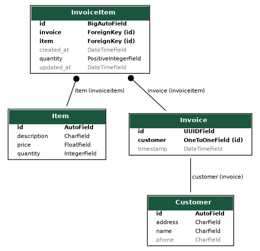

# Disecto : Backend Dev Assignment

- [Assumptions](#assumptions)
- [Setup](#setup)
- [Urls](#urls)
- [Models](#models)
- [Task 2](#task-2)
- [Hosting](#hosting)
- [Task 4](#task-4)


## assumptions

- `PUT` method either creates request for new items and/or update requests of previous items. Items not included in a `PUT` request, if they exist in invoice earlier, do not get deleted. 
- if `POST` method is called for an item that is already in invoice, it would result in error. the task of updation is solely via `PUT` method 
- if there is error for even one item in `POST` or `PUT` (i.e. due to insufficient stocks, item id does not exist etc), entire request fails
- each invoice is one-to-one mapped to customer. practically there could be many invoices per customer and it should be many-to-one mapped. but keeping things simple here (as then one would also need to provide some sort of invoice `id` apart from customer `id` while testing) 
- invoice template has been taken from weasyprint examples, and works on single page pdf. hence in case of large no. of items, invoice pdf may hide some items


## setup

- clone the repository

```
git clone https://github.com/gurbaaz27/disecto-backdev-task.git
cd disecto-backdev-task
```

- create virtual environment using `venv` or `conda`

```
conda create -n venv python -y
conda activate venv
```

- install the dependencies

```
pip install -r requirement.txt
```

- setup your models and database, collect static (optional), create a superuser (to explore admin dashboard)

```
python manage.py makemigrations
python manage.py migrate
python manage.py collectstatic
python manage.py createsuperuser
```

- fire up your server and head over to [http://127.0.0.1:8000](http://127.0.0.1:8000)

```
python manage.py runserver
```

## urls

- GET: get the list of available items with details such as (name, price, description).
```
http://127.0.0.1:8000/api/items
```

- POST: to send the list of items to buy with corresponding quantities.
- PUT: to update the list of items in the purchase list.
- GET: get the invoice for the purchase in pdf format as per the above format but with all the necessary details filled dynamically

```
http://127.0.0.1:8000/api/customer-purchase/<int:customer-id>
```

- GET : returns txt file containing item list of low stock
```
http://127.0.0.1:8000/api/low-stock-items/
```

- apart from this, we have some utility apis

```
# view/add details of customers with get/post
http://127.0.0.1:8000/api/customers/ 
# add details of new items with post
http://127.0.0.1:8000/api/items/
```


## models



- Customer (Name, Phone No., Address)
- Item (Description, Price)
- Invoice (Customer, Timestamp)
- InvoiceItems (Invoice, Item, Quantity)


## task 2

created a django management command `generate_stock_list` to generate a list of products/items with low stock/expiry from the inventory database.

```
python manage.py generate_stock_list --help

usage: manage.py generate_stock_list [-h] [--version] [-v {0,1,2,3}] [--settings SETTINGS] [--pythonpath PYTHONPATH] [--traceback] [--no-color]
                                     [--force-color] [--skip-checks]

Auto generate a list of products/items with low stock/expiry from the inventory database.
```

below command can be scheduled via `cron` utility to run 12 AM daily on the server side

```
python manage.py generate_stock_list
```

## hosting

the server has been hosted on [gurbaaz.pythonanywhere.com](https://gurbaaz.pythonanywhere.com)

apis can be tested by replacing <https://127.0.0.1:8000> with <https://gurbaaz.pythonanywhere.com>

## task 4

